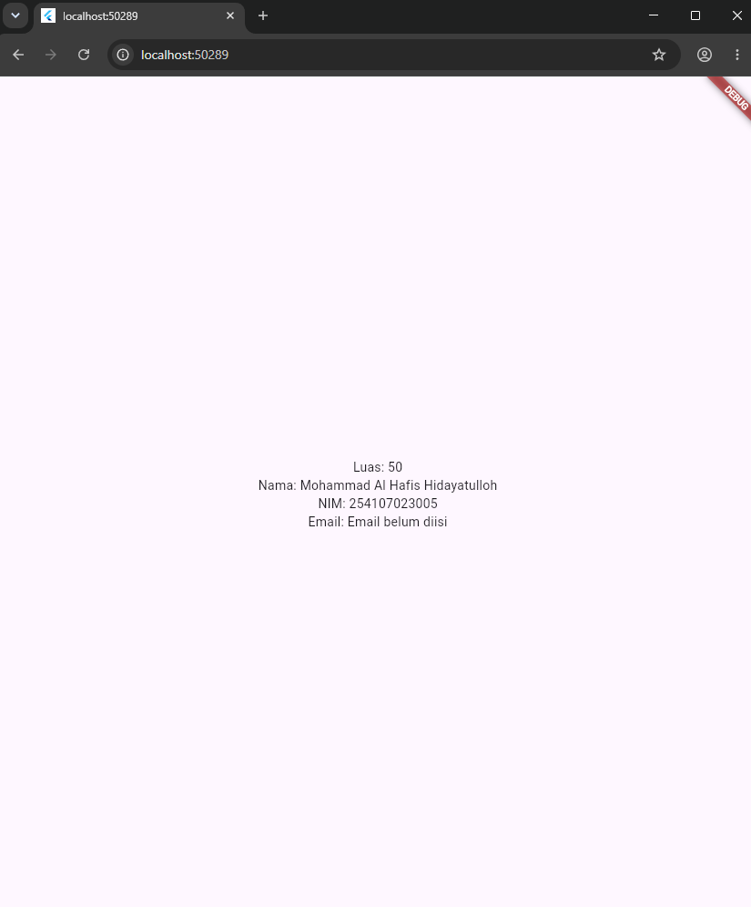
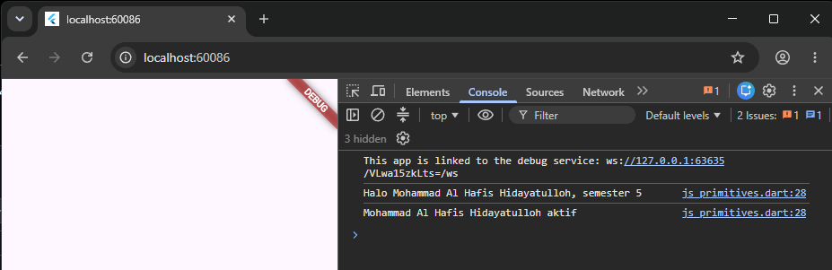
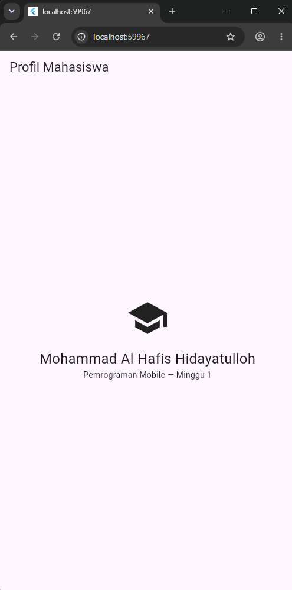
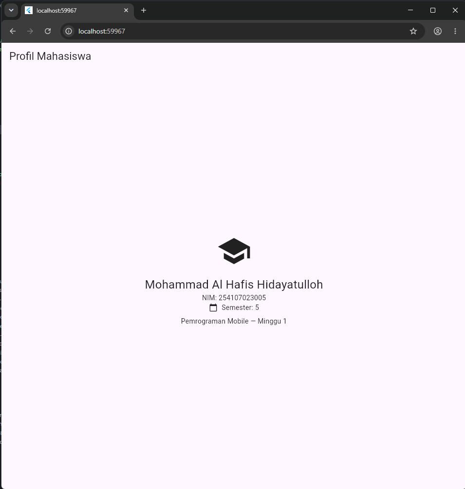

# 01 Week 1 - Mobile Development Ecosystem & Flutter Refresh

Repository ini berisi hasil praktikum Flutter minggu pertama mengenai setup environment, dasar Dart, widget Flutter, hot reload/hot restart, serta pembuatan aplikasi sederhana **Profil Mahasiswa**.

## Profil Mahasiswa

Data yang digunakan:

- Nama: Mohammad Al Hafis Hidayatulloh
- NIM: 254107023005
- Semester: 5
- Status: Aktif
- Email: null/belum diisi

Contoh tampilan informasi:




Screenshot hasil latihan Mandiri



Screenshot hasil Praktikum



Hasil dengan widget




##  Verifikasi, Tugas, dan Refleksi

### Checklist Verifikasi

- [x] `flutter doctor` tidak memiliki masalah yang menghambat target Android.
- [x] `flutter devices` dapat mendeteksi emulator/perangkat.
- [x] Aplikasi dapat dijalankan menggunakan Flutter.
- [x] UI default Flutter telah diganti dengan profil mahasiswa sederhana.
- [x] Memahami perbedaan hot reload dan hot restart.
- [x] Source code dan README telah disiapkan untuk repository.
- [x] Screenshot aplikasi ditambahkan ke repository.
- [x] Repository telah di-push ke remote repository.

### Mini Assignment

Aplikasi **Profil Mahasiswa** dibuat berdasarkan praktikum Flutter dengan menampilkan beberapa informasi menggunakan widget dasar.

Informasi yang ditampilkan meliputi:

- Nama mahasiswa
- NIM
- Semester
- Status mahasiswa
- Email

### Kendala Setup

- Salah satu kendala yang ditemukan adalah perubahan kode pada `main()` tidak langsung terlihat setelah melakukan hot reload. Tampilan yang muncul di emulator masih menggunakan kode sebelumnya.
Solusinya adalah melakukan hot restart atau menghentikan aplikasi kemudian menjalankannya kembali menggunakan:

```bash
flutter run
```

- Selain itu, penggunaan `print()` hanya menampilkan output di console dan tidak otomatis menampilkan teks pada UI Flutter. Agar data tampil di halaman aplikasi, data perlu dimasukkan ke widget seperti `Text`.

## Perbedaan Hot Reload dan Hot Restart

Hot Reload memperbarui perubahan kode ke aplikasi yang sedang berjalan tanpa memulai ulang seluruh aplikasi. State aplikasi biasanya tetap dipertahankan.

Hot Restart menjalankan ulang aplikasi dari awal dan mengeksekusi kembali fungsi `main()`. State sebelumnya akan di-reset.

Hot reload cocok untuk perubahan tampilan kecil, sedangkan hot restart diperlukan ketika perubahan berkaitan dengan proses awal aplikasi atau perubahan yang tidak ter-update melalui hot reload.

# Refleksi

## 1. Kapan native lebih tepat dipilih daripada cross-platform?

Native lebih tepat digunakan ketika aplikasi membutuhkan integrasi yang sangat dalam dengan fitur khusus sistem operasi, membutuhkan performa maksimal, atau sangat bergantung pada API platform tertentu. Contohnya aplikasi yang menggunakan fitur perangkat secara intensif atau membutuhkan optimasi khusus Android/iOS.

## 2. Bagaimana perubahan state berhubungan dengan widget tree dan UI deklaratif?

Flutter menggunakan pendekatan UI deklaratif. Tampilan merupakan representasi dari state saat ini. Ketika state berubah, Flutter membangun kembali bagian widget tree yang membutuhkan perubahan sehingga UI menyesuaikan dengan data terbaru.
Artinya, developer tidak perlu mengubah tampilan satu per satu secara manual. Developer cukup mengubah state, kemudian Flutter memperbarui UI berdasarkan state tersebut.

## 3. Mengapa commit kecil dengan pesan jelas bermanfaat bagi pekerjaan tim dan portfolio?

Commit kecil dengan pesan yang jelas membuat riwayat perubahan lebih mudah dibaca dan dipahami. Dalam kerja tim, hal ini membantu anggota lain mengetahui perubahan yang dilakukan serta mempermudah pencarian penyebab error.
Dalam portfolio, riwayat commit yang rapi juga menunjukkan proses pengerjaan project, konsistensi, dan kebiasaan menggunakan version control dengan baik.
