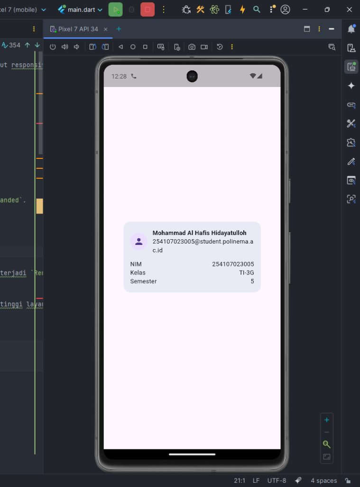
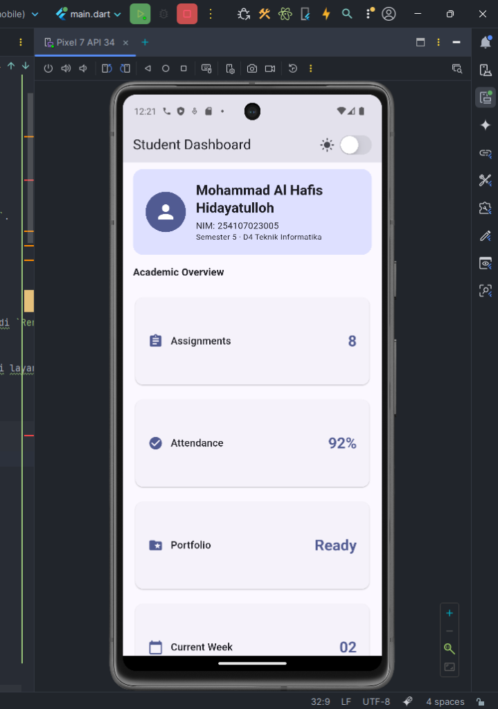
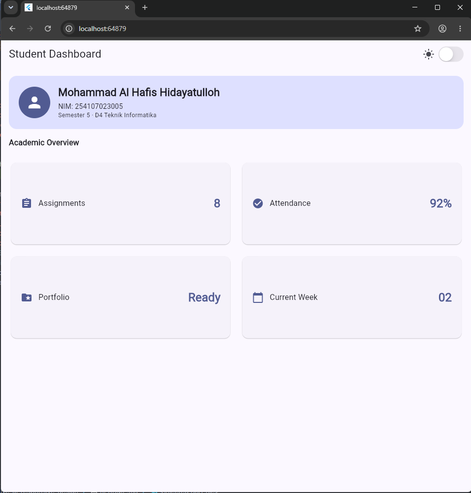
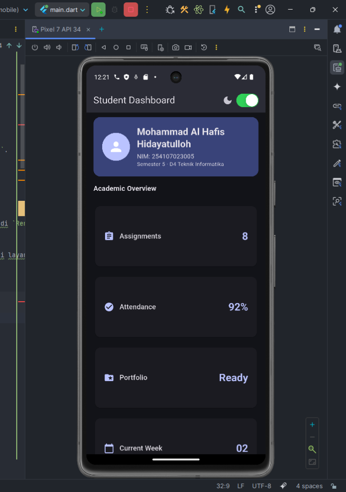

# 02 Week 2 - Declarative UI & Responsive Design

Repository ini berisi hasil praktikum Flutter minggu kedua mengenai declarative UI, widget dasar, layout responsif, theme, dark mode, serta pembuatan **Academic Overview Dashboard**.

## Profil Mahasiswa

- Nama: Mohammad Al Hafis Hidayatulloh
- NIM: 254107023005
- Semester: 5
- Kelas: TI-3G&#x0D;&#x0A;- Email: 254107023005@student.polinema.ac.id&#x0D;&#x0A;- Status: Aktif

---

## Praktikum 4: Layout Sederhana (Warm-up)

Membuat `ProfileCard` menggunakan widget dasar: `Container`, `Column`, `Row`, `CircleAvatar`, dan `Expanded`.



### Eksperimen Warm-up

**1. Hapus `Expanded` pada baris nama:**
Tanpa `Expanded`, teks nama akan mencoba mengambil ruang sebanyak yang dibutuhkan. Jika teks panjang, terjadi `RenderFlex overflowed` karena Row tidak tahu harus membagi ruang ke mana.

**2. Ganti `mainAxisSize: MainAxisSize.min` ke default:**
Nilai default `MainAxisSize.max` membuat Column mengisi seluruh tinggi yang tersedia. Kartu menjadi setinggi layar penuh.

**3. Tambah baris Email dengan pola `Row + Expanded`:**
```dart
const Row(children: [
  Expanded(child: Text('Email')),
  Text('254107023005@student.polinema.ac.id'),
]),
```

---

## Praktikum 5: Dashboard Responsif

Membuat dashboard responsif menggunakan `LayoutBuilder` + `GridView.count`.

### Screenshot Layar Sempit (1 kolom)



### Screenshot Layar Lebar (2 kolom)



### Screenshot Dark Mode



---

## Tugas: Academic Overview Dashboard

### Struktur file

| File | Keterangan |
|------|-----------|
| `lib/main.dart` | Entry point: `DashboardApp` (StatefulWidget) |
| `lib/dashboard_page.dart` | `DashboardPage` dengan header profil + grid |
| `lib/dashboard_card.dart` | Reusable `DashboardCard` widget |
| `lib/profile_card.dart` | Warm-up: `ProfileCard` (Praktikum 4) |
| `test/widget_test.dart` | 2 widget tests responsif |

### Fitur

- **Header profil** dengan nama, NIM, dan semester
- **4 kartu informasi**: Assignments, Attendance, Portfolio, Current Week
- **Responsive layout**: 1 kolom (`< 700px`) / 2 kolom (`>= 700px`) via `LayoutBuilder`
- **Dark mode toggle** menggunakan `CupertinoSwitch`
- **Aksesibilitas**: `Semantics` label pada kartu dan toggle
- **Breakpoint terpusat**: `const kWideBreakpoint = 700`

---

## AI Prompt Challenge

### Prompt 1 - Desain
> "Bandingkan dua tata letak dashboard akademik untuk Flutter: versi GridView dan versi LayoutBuilder + Column. Jelaskan trade-off responsif dan aksesibilitasnya."

**Output AI (ringkasan):**
- `GridView` lebih mudah untuk grid seragam, namun kurang fleksibel untuk header/section berbeda
- `LayoutBuilder + Column` lebih fleksibel untuk layout mixed, tapi lebih verbose
- **Keputusan yang dipilih**: kombinasi keduanya — `LayoutBuilder` di luar untuk membaca lebar, `GridView.count` di dalam untuk kartu

**Verifikasi**: Diuji di browser dengan lebar 400px dan 1200px — layout berubah sesuai breakpoint ✅

### Prompt 2 - Penguatan Konsep
> "Jelaskan kapan penggunaan Expanded justru menyebabkan overflow di dalam Row, beri contoh kode yang gagal dan perbaikannya."

**Output AI (ringkasan):**
- `Expanded` hanya bisa digunakan langsung di dalam `Row`, `Column`, atau `Flex`
- Jika `Expanded` diletakkan di dalam `Column` yang tidak memiliki bounded height (misal di dalam `SingleChildScrollView` tanpa `shrinkWrap`), terjadi error unbounded constraints

**Contoh gagal:**
```dart
Column(children: [
  Expanded(child: Text('Overflow!')), // Error jika Column tidak bounded
])
```
**Perbaikan:** Gunakan `Flexible` atau berikan `mainAxisSize: MainAxisSize.min`

### Prompt 3 - Verifikasi
> "Periksa kembali rekomendasi layout di atas: apakah tetap responsif di bawah 600px, apakah mengurangi aksesibilitas, dan apakah ada widget yang tidak tersedia di Flutter stabil saat ini?"

**Hasil verifikasi:**
- ✅ Responsif di bawah 600px — breakpoint 700px bekerja
- ✅ Aksesibilitas terjaga — `Semantics` label ditambahkan pada elemen penting
- ✅ Semua widget (`LayoutBuilder`, `GridView`, `CupertinoSwitch`) tersedia di Flutter stable

---

## Checklist Verifikasi

- [x] `flutter analyze` tidak menghasilkan error
- [x] `flutter test` lulus semua widget test responsif
- [x] Aplikasi dapat dijalankan pada ukuran layar sempit dan lebar
- [x] Dark mode memiliki kontras dan teks yang terbaca
- [x] Struktur widget dapat dijelaskan saat code review
- [x] Screenshot, folder `test/`, dan README sudah tersimpan

---

## Refleksi

### 1. Apa perbedaan cara berpikir imperative dan declarative saat membangun UI?

**Imperatif**: Developer mengontrol setiap perubahan secara manual. Contoh: `button.text = "Klik"`, `label.visible = false`. Developer harus tahu *bagaimana* mengubah tampilan.

**Deklaratif (Flutter)**: Developer mendeskripsikan tampilan berdasarkan *state saat ini*. Ketika state berubah, Flutter membangun ulang widget yang relevan secara otomatis. Developer fokus pada *apa yang harus ditampilkan*, bukan *bagaimana cara mengubahnya*.

### 2. Kapan `Expanded` membantu dan kapan justru menghasilkan layout error?

**Membantu**: Ketika ada sisa ruang di `Row`/`Column` yang perlu dibagi rata atau proporsional antar child. Contoh: satu label di kiri, satu nilai di kanan — label menggunakan `Expanded` agar fleksibel.

**Menghasilkan error**: Ketika `Expanded` diletakkan di dalam widget yang tidak memiliki *bounded constraints* di arah yang sama. Contoh: `Expanded` di dalam `Column` yang berada di `SingleChildScrollView` tanpa batas tinggi pasti → error "RenderFlex has unbounded constraints".

### 3. Bagaimana breakpoint dan theme memengaruhi pengalaman pengguna?

**Breakpoint** menentukan kapan layout berubah strukturnya. Breakpoint yang tepat (misal 700px) membuat aplikasi nyaman di ponsel (1 kolom) maupun tablet (2 kolom) tanpa elemen yang terlalu rapat atau terlalu longgar.

**Theme** menyimpan warna, tipografi, dan shape secara terpusat. Dengan `Theme.of(context)`, komponen secara otomatis menyesuaikan diri saat dark mode aktif — tanpa harus mengubah setiap widget satu per satu.

### 4. Apa yang Anda verifikasi dari rekomendasi AI setelah tugas inti selesai?

Setelah AI merekomendasikan kombinasi `LayoutBuilder + GridView`, saya memverifikasi:
1. Layout benar-benar responsif di lebar < 600px (diuji di Chrome)
2. Aksesibilitas terjaga — `Semantics` label sudah ditambahkan
3. Widget yang digunakan (`CupertinoSwitch`, `LayoutBuilder`) tersedia di Flutter stable
4. `flutter test` lulus untuk kedua skenario (layar sempit dan lebar)

---

## Referensi

- [Flutter UI documentation](https://docs.flutter.dev/ui)
- [Building responsive apps](https://docs.flutter.dev/ui/layout/responsive)
- [Material Design 3](https://m3.material.io/)
- [Flutter accessibility](https://docs.flutter.dev/ui/accessibility-and-internationalization/accessibility)

