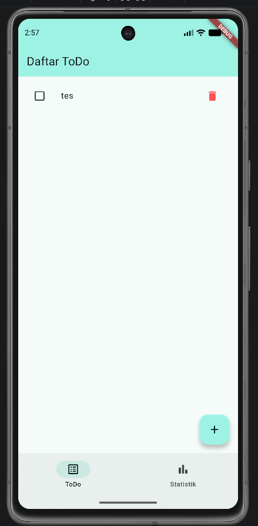
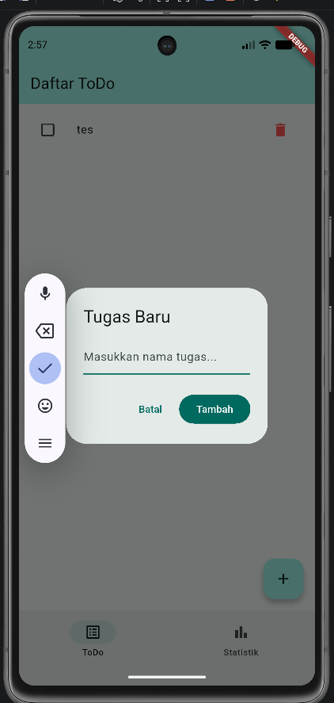

# Week 3 - Navigation & State Management

Ini adalah repositori untuk tugas Mini Project / Industry Challenge Minggu ke-3 mata kuliah Pemrograman Mobile. Aplikasi ini adalah aplikasi **ToDo** sederhana yang diintegrasikan dengan fitur **Navigation** menggunakan `go_router` dan **State Management** menggunakan `flutter_riverpod`.

## Fitur Utama
1. **Daftar ToDo**: Menambah, mengubah status (Selesai/Belum), dan menghapus tugas. Menggunakan `Notifier` dan di-render menggunakan `ConsumerWidget`. Item direfaktor menggunakan komponen independen `TodoTile`.
2. **Statistik (AI Challenge)**: Menggunakan `AsyncNotifier` untuk mensimulasikan pengambilan data statistik asinkron (delay 2 detik) dengan tingkat kegagalan (error) 30%.
3. **Penanganan Status Async**: Menggunakan `AsyncValue.when` untuk menampilkan status *Loading* (Spinner), *Error* (Pesan Error + Tombol *Coba Lagi* via `ref.invalidate`), dan *Success* (Daftar Statistik).
4. **Navigasi Persisten**: Menggunakan `GoRouter` dengan `ShellRoute` dan `NavigationBar` sehingga pengguna dapat berpindah antara halaman ToDo dan Statistik dengan mudah, tanpa kehilangan State.

## Tech Stack
- **Framework**: Flutter
- **Router**: `go_router` (Declarative Routing)
- **State Management**: `flutter_riverpod` (Compile-safe Provider)
- **Desain**: Material 3 (Tema warna Teal)

## Cara Menjalankan
1. Pastikan Anda berada di direktori project ini (`03-week-3-navigation-state-management`).
2. Jalankan perintah `flutter pub get` untuk menginstal dependencies.
3. Jalankan aplikasi menggunakan perintah `flutter run`.

---

## Refleksi

**1. Kapan `setState` masih cukup, dan kapan state harus naik ke Riverpod?**
`setState` masih sangat cukup untuk mengelola *local state* sementara (ephemeral state), contohnya state animasi dalam satu widget, nilai *controller* pada TextField sebelum di-submit, atau UI state minor seperti toggle tab lokal.
State harus naik ke Riverpod jika state tersebut perlu "dibagikan" (shared state) lintas halaman, perlu bertahan meski widget induknya dihancurkan (*state retention*), atau memiliki logika asinkron kompleks (seperti memanggil API) agar logika terpisah dari antarmuka UI.

**2. Apa perbedaan `context.go` dan `context.push`, dan kapan masing-masing tepat digunakan?**
- `context.go()`: Mengganti struktur *stack* navigasi sesuai rute deklaratif. Cocok untuk berpindah ke rute akar (seperti pindah menu dari *BottomNavigationBar*) atau rute yang tidak membutuhkan tombol "*Back*".
- `context.push()`: Menumpuk halaman baru di atas tumpukan navigasi saat ini. Sangat cocok digunakan untuk navigasi *drill-down*, misalnya dari halaman daftar item menuju ke halaman detail item.

**3. Bagaimana `AsyncValue` mencegah bug dibanding tiga boolean terpisah?**
Jika menggunakan 3 boolean terpisah (`isLoading`, `hasError`, `isSuccess`), sangat mungkin terjadi inkonsistensi status (contoh: `isLoading` masih `true`, tapi `hasError` juga `true`). `AsyncValue` membungkus status tersebut ke dalam satu *tipe union*, sehingga mustahil suatu state berada di dua status sekaligus secara bersamaan. Penggunaan method `.when()` di UI juga memaksa *developer* untuk selalu menangani ketiga skenario tersebut, mencegah layar kosong atau perilaku bug saat error terjadi.

**4. Bagian mana dari hasil AI yang Anda perbaiki, dan mengapa?**
- **Perbaikan Provider**: AI awalnya mengusulkan penggunaan `StateNotifierProvider` (Riverpod 1.0) untuk simulasi asinkron. Saya mengubahnya menjadi `AsyncNotifierProvider` (Riverpod 2.0+) karena itu standar masa depan yang direkomendasikan dan lebih aman secara *compile-time*.
- **Perbaikan Logika Retry**: AI menulis kode pemanggilan fungsi fungsi `fetch()` baru secara manual di UI. Saya mengubah tombol *retry* menjadi menggunakan `ref.invalidate(statsProvider)` agar provider otomatis me-refresh dirinya secara native sesuai pola Riverpod.

## Dokumentasi AI Challenge
Catatan lengkap seputar percobaan AI Prompt Challenge dapat dilihat pada file [docs/ai_challenge.md](./docs/ai_challenge.md).

## Screenshots
Berikut adalah tangkapan layar aplikasi saat dijalankan:

| Beranda (Daftar ToDo) | Dialog Tambah Tugas |
| :---: | :---: |
|  |  |
