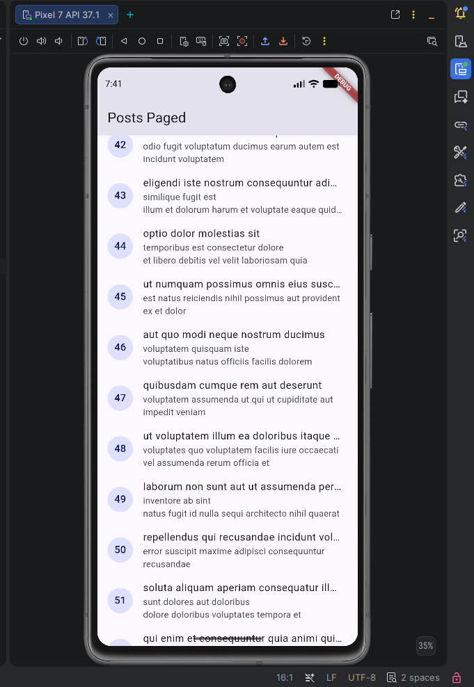

# Week 4 - Networking & REST API

Repositori ini memuat *Mini Project* untuk Praktikum Minggu ke-4. Aplikasi ini berfokus pada integrasi *REST API* menggunakan package **Dio** dan **Riverpod** sebagai state management.

## Demo Aplikasi


[🎬 Tonton Video Demonstrasi Aplikasi](screenshots/post-page.mp4)

## Fitur
1. **Daftar Post (Infinite Scroll)**: Menerapkan *pagination* di *client-side* untuk memuat 10 item tambahan setiap kali pengguna *scroll* ke bawah.
2. **Detail Post & Comments (AI Challenge)**: Rute `/post/:id` menampilkan detail dan komentar dari API khusus dengan proteksi *timeout*.
3. **State Loading/Error/Success Terpusat**: Seluruh tampilan memetakan Exception jaringan (DioException) ke dalam bahasa yang mudah dimengerti. 
4. **Offline Mock Testing**: Mendemonstrasikan penggunaan `FakePostRepository` pada *Unit Test*.

## Tech Stack
- **HTTP Client**: `dio` (Base URL terpusat, Logging Interceptor)
- **State Management**: `flutter_riverpod` (AsyncNotifier)
- **Router**: `go_router`

## Cara Menjalankan
1. Pastikan Anda berada di root proyek.
2. Unduh dependensi: `flutter pub get`.
3. Jalankan: `flutter run`.

---

## Refleksi

**1. Mengapa UI dilarang memanggil Dio langsung? Apa yang rusak jika aturan ini dilanggar?**
Memanggil Dio langsung dari antarmuka (UI) membuat *Spaghetti Code* dan menggabungkan logika jaringan dengan komponen grafis. Jika aturan ini dilanggar, UI menjadi tidak bisa diuji secara independen (karena butuh koneksi sungguhan), jika *endpoint* API berubah maka ribuan baris UI harus ikut diganti, dan jika pengguna berpindah layar saat `await Dio` masih berjalan, aplikasi berisiko terkena *memory leak* atau *crash*. 

**2. Kapan pagination client-side cukup, dan kapan harus mengandalkan pagination server (_page/_limit)?**
- *Client-side pagination*: Cukup jika seluruh data (semua *record*) sudah diambil dari server di awal dan jumlah datanya kecil-menengah (misal <500 baris). Paginasi hanya membatasi apa yang di-render di layar agar tidak *lag*.
- *Server-side pagination* (`_page/_limit`): Wajib digunakan jika *database* backend berisi ribuan/jutaan *record* karena mengambil semuanya di awal akan menghancurkan kuota internet dan RAM pengguna, serta menahan *response* menjadi sangat lama.

**3. Bagaimana exception repository berubah menjadi AsyncError tanpa try/catch di setiap widget? Kapan try/catch eksplisit tetap dibutuhkan?**
`AsyncNotifierProvider` secara otomatis membungkus fungsi `build()` miliknya ke dalam penanganan asinkron. Jika di *repository* terjadi *throw Exception*, ia akan menggelembung (*bubble-up*) ke Riverpod, dan Riverpod langsung memperbarui status *provider*-nya menjadi `.hasError` yang memicu `.when(error: ...)` di *UI*.
*Try/catch* eksplisit tetap dibutuhkan pada aksi manual (seperti fungsi `.refresh()` atau submit data Form), di mana kita harus memperbarui `state = AsyncError(...)` secara manual.

**4. Bagian mana dari hasil AI yang Anda perbaiki, dan mengapa?**
AI kerap membuat fungsi `fromJson` yang mencoba men-*cast* secara sepihak misalnya `json['userId'] as int`. Jika nilai aslinya `null` atau `String`, ini akan menyebabkan crash aplikasi berantai. Oleh karena itu saya membungkusnya dengan *defensive cast* `(json['userId'] as num?)?.toInt() ?? 0` untuk proteksi *Null-Safety* mutlak. Saya juga mengubah instruksi *try-catch* AI di *repository* agar dilempar bebas, memanfaatkan *native error-handling* Riverpod.

---

## AI Prompt Challenge

**Prompt yang Digunakan:**
```text
Buatkan repository layer Flutter untuk endpoint GET /comments?postId={id}
dari JSONPlaceholder menggunakan Dio + flutter_riverpod.
Requirements:
- Model Comment dengan fromJson aman null (postId, id, name, email, body).
- CommentRepository dengan method fetchComments(postId) + timeout 10 detik.
- AsyncNotifierProvider dengan penanganan error otomatis (AsyncError)
  dan fungsi pesan error ramah pengguna untuk timeout, connection error, 404, dan 500.
- Satu unit test untuk fromJson dengan field yang hilang.
Jelaskan setiap bagian kode dalam komentar.
```

**AI Verification Checklist:**
- **Apakah UI memanggil Dio secara langsung?** Tidak. UI hanya membaca dari `commentProvider` yang akan memanggil `CommentRepository`.
- **Apakah fromJson aman null?** Ya, `Comment.fromJson` menggunakan defensive casting (`as String? ?? ''`).
- **Apakah semua tipe DioExceptionType dipetakan ke pesan pengguna?** Ya, telah dibuatkan helper `friendlyErrorMessage` di `network_errors.dart`.
- **Apakah baseUrl/timeout terpusat?** Ya, konfigurasi utama ada di `api_client.dart`. Namun khusus untuk `fetchComments`, ada _override_ eksplisit untuk menambahkan proteksi timeout 10 detik tambahan melalui `RequestOptions`.
- **Apakah test AI menguji field hilang?** Ya, unit test `Comment.fromJson` untuk _missing field_ telah dibuat di `test/comment_test.dart`.

**Perbaikan yang Dilakukan:**
AI awalnya sering menyarankan blok `try-catch` langsung di dalam fungsi `CommentRepository`. Saya mengubahnya dan memastikan agar *exception* dibiarkan lolos (*throw*). Hal ini membuat Riverpod `AsyncNotifierProvider` dapat menangkapnya dan merubahnya secara otomatis menjadi state `AsyncError` secara *native*, bukan malah menelan error secara diam-diam.
