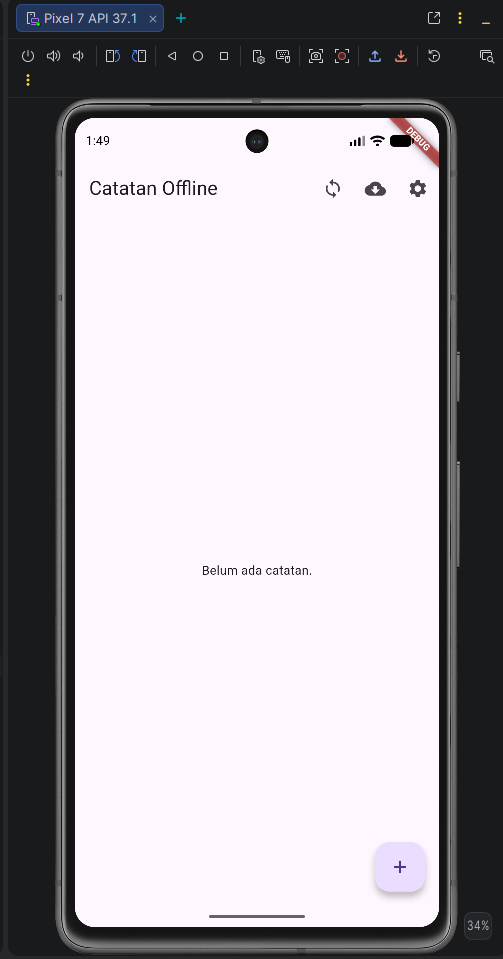
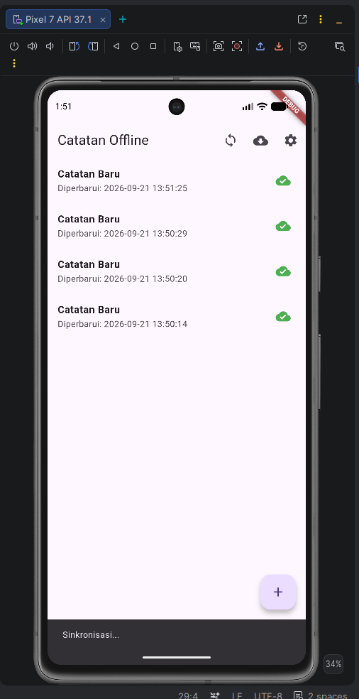
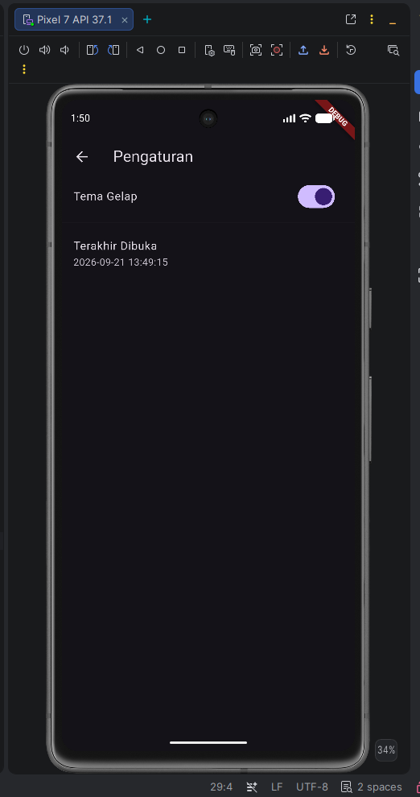
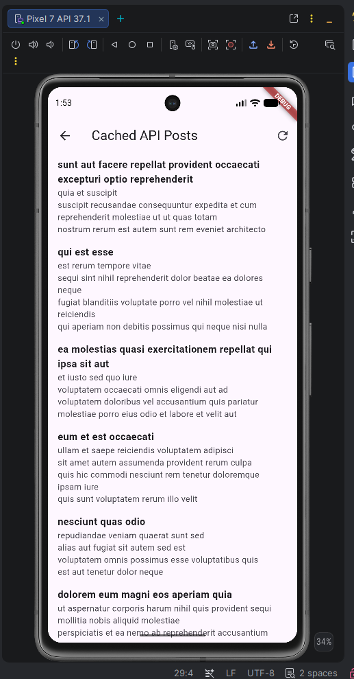

# Week 5 - Local Storage & Offline-First

Repositori ini memuat *Mini Project* untuk Praktikum Minggu ke-5. Aplikasi "Offline Notes" mendemonstrasikan implementasi *Local Storage* dan pola arsitektur *Offline-First* di Flutter.

## Demo Aplikasi

## Fitur Utama
1. **Preferensi Pengguna**: Fitur *Dark Mode* dan waktu *Terakhir Dibuka* tersimpan secara lokal dan di-*load* sangat cepat menggunakan `SharedPreferences`.
2. **Catatan Offline-First**: Aplikasi membaca langsung dari database *SQLite* (sqflite) secara kilat tanpa memerlukan koneksi internet.
3. **Mekanisme Sinkronisasi (Dirty Flag)**: Setiap penambahan catatan di mode *offline* akan ditandai *(dirty)* dan akan disinkronkan secara massal ke server (*mock-delay*) ketika pengguna menekan tombol sinkronisasi.
4. **Cache-First Posts**: Halaman cache yang menampilkan API JSONPlaceholder *(dari minggu 4)* tanpa internet.
5. **UI Terstruktur**: Menggunakan Riverpod `AsyncNotifier` untuk mengontrol indikator pemuatan sinkronisasi (loading) dan galat (error) di semua lapisan UI.

## Tech Stack
- **Database Relasional**: `sqflite` (dengan pola *Repository Pattern*)
- **Preferensi Key-Value**: `shared_preferences`
- **State Management**: `flutter_riverpod` (AsyncValue & AsyncNotifier)
- **Router**: `go_router`
- **Networking**: `dio` (untuk simulasi cache data eksternal)

## Cara Menjalankan
1. Pastikan berada dalam *folder* `05-week-5-local-storage-offline-first`.
2. Unduh dependensi: `flutter pub get`.
3. Jalankan aplikasi: `flutter run`.
4. **Uji Offline-First**: Aktifkan **Mode Pesawat** pada emulator/perangkat, buka aplikasi, buat catatan baru (ikon *dirty badge* akan muncul). Matikan mode pesawat dan tekan tombol *Sync* di atas.

---

## Refleksi

**1. Mengapa daftar catatan tidak boleh disimpan di SharedPreferences? Apa yang rusak jika aturan ini dilanggar?**
`SharedPreferences` dirancang eksklusif untuk data pengaturan skalar yang sangat ringan. Menyimpan 1000 catatan *(String JSON raksasa)* di sana akan memaksa aplikasi melakukan deserialisasi berat yang dapat membekukan *UI Thread* setiap aplikasi diluncurkan *(jank/lag)*. Aturan ini jika dilanggar akan menyebabkan masalah performa ekstrem, menghalangi kueri parsial (sulit memfilter catatan berdasarkan tanggal), hingga risiko korupsi memori (*memory leak*).

**2. Kapan cache-first cukup, dan kapan Anda membutuhkan strategi lain (misalnya network-first untuk data harga real-time)?**
Strategi *cache-first* (membaca lokal duluan, refresh di background) sangat cukup untuk data yang toleran terhadap usang (misalnya: umpan berita, *timeline*, catatan, profil pengguna). Kita membutuhkan *network-first* apabila data tersebut bernilai sangat kritis dan harus 100% *real-time*, contohnya: fluktuasi harga saham, saldo bank elektronik, atau ketersediaan kursi tiket pesawat.

**3. Bagaimana dirty flag berubah menjadi antrean sync tanpa memblokir UI? Kapan antrean terpisah (tabel outbox) menjadi perlu?**
*Dirty flag* (misal angka 1 di kolom db) membiarkan aplikasi menyelesaikan operasinya secara lokal segera, sehingga *UI* segera terbaharui tanpa menunggu jaringan (*non-blocking*). Di latar belakang, fungsi asinkron bisa menyerok semua baris dengan `dirty=1` dan mengirimnya. Tabel *Outbox* (antrean terpisah) baru akan diperlukan jika aplikasi memiliki urutan transaksi mutasi yang sangat kompleks dan rentan (misal: membuat *Header* pesanan, membuat *Detail* Item, dan membayar, di mana kegagalan pengiriman harus dapat di-*rollback* atau dikirim dengan *sequence* ketat).

**4. Bagian mana dari rekomendasi AI yang Anda tolak, dan mengapa?**
Berdasarkan dokumen `docs/ai_challenge.md` yang saya buat:
Saya menolak *Drift* (meski punya kapabilitas Stream *real-time* yang dijanjikan AI) karena ukuran *boilerplate* dan *code-generation* miliknya terlalu rumit *(overkill)* untuk purwarupa sederhana ini. Selain itu, saya secara mutlak menolak jika AI merekomendasikan `SharedPreferences` untuk koleksi Catatan karena alasan kebangkrutan memori pada poin nomor 1. Karena itu, SQLite (`sqflite`) terpilih sebagai jalan tengah *type-safety* dan minim-infrastruktur yang paling masuk akal.
