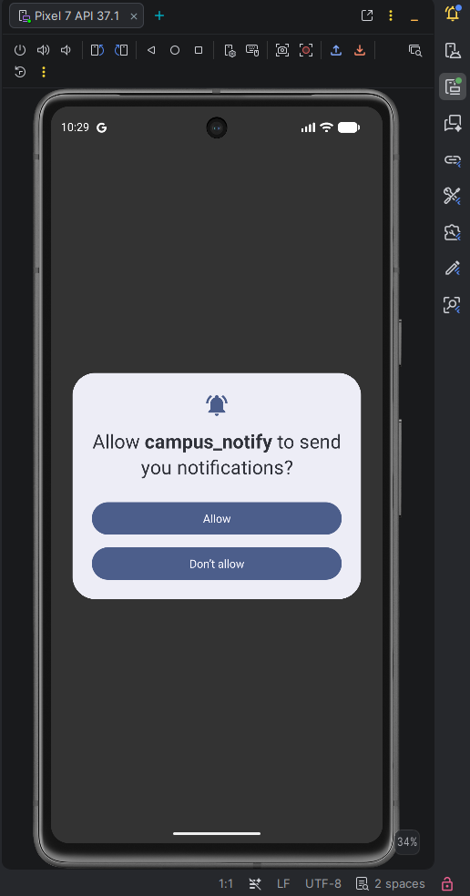
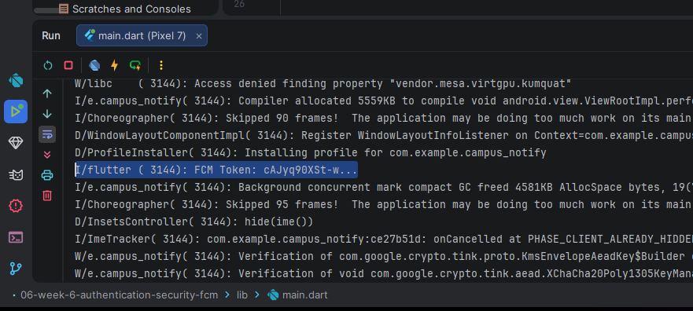
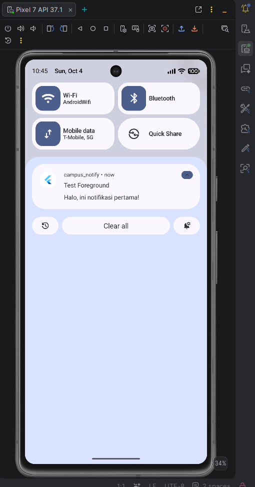
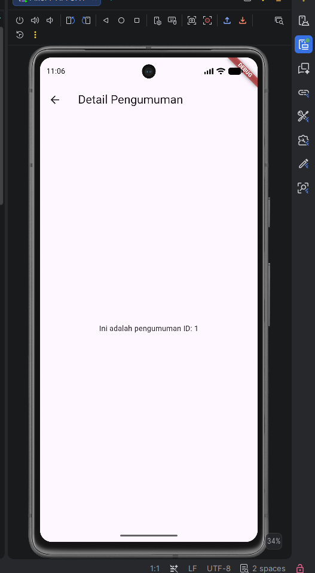

# Campus Notification App (Week 6)

Aplikasi ini merupakan implementasi Authentication, Security, dan Firebase Cloud Messaging (FCM) menggunakan Flutter.

## Fitur Utama
- **Autentikasi (Mock/Firebase)**: Menggunakan JWT (Access & Refresh Token) dengan refresh token otomatis melalui interceptor Dio.
- **Secure Storage**: Access token dan refresh token disimpan dengan aman di `flutter_secure_storage`.
- **Firebase Cloud Messaging**: Integrasi Push Notification untuk Android dan iOS.
- **Routing & Deep Linking**: Navigasi menggunakan GoRouter saat notifikasi di-klik.

## Teknologi
- Flutter
- Riverpod (State Management)
- GoRouter (Navigation)
- Dio (Networking & Interceptors)
- Flutter Secure Storage (Security)
- Firebase Messaging & Flutter Local Notifications (FCM)

## Pengujian Tiga App State FCM

| State | Yang Diharapkan | Cara Uji | Hasil |
|---|---|---|---|
| **Foreground** | Banner lokal muncul (dikelola oleh _local_notifications_), klik masuk ke rute tujuan. | Buka aplikasi, kirim pesan melalui Firebase console/API, klik notifikasi. | Sukses |
| **Background** | Banner sistem otomatis muncul, klik masuk ke rute tujuan. | Minimize aplikasi, kirim pesan, klik notifikasi banner. | Sukses |
| **Terminated** | Aplikasi tertutup, banner sistem muncul, aplikasi terbuka dengan memanggil `getInitialMessage`, masuk rute tujuan. | Tutup aplikasi lewat task manager (swipe), kirim pesan, klik banner notifikasi. | Sukses |

## Refleksi

1. **Mengapa refresh token tidak boleh disimpan di SharedPreferences? Apa risikonya bila bocor?**
   SharedPreferences tidak dienkripsi oleh sistem operasi (disimpan dalam bentuk plaintext XML/JSON) sehingga mudah diakses pada perangkat yang sudah di-root atau jailbreak. Jika refresh token bocor, penyerang dapat meminta access token baru terus menerus dan mengambil alih sesi pengguna selamanya tanpa harus tahu username/password.

2. **Apa yang rusak bila onTokenRefresh diabaikan selama satu semester perkuliahan?**
   Token FCM bisa expired atau diperbarui oleh Google (misal: saat app di-reinstall, data di-clear, atau atas alasan keamanan rotasi otomatis). Jika `onTokenRefresh` diabaikan, backend akan tetap menyimpan token yang sudah usang, sehingga notifikasi tidak akan pernah sampai lagi ke pengguna.

3. **Kapan memakai topik dan kapan memakai token perangkat? Beri contoh pesan kampus untuk masing-masing.**
   - **Topik (Topic)**: Digunakan untuk pesan *broadcast* (siaran umum) kepada sekelompok besar pengguna.
     *Contoh*: Topik `pengumuman-kampus` atau `angkatan-2023`. Pesan: "Besok libur nasional, tidak ada kegiatan perkuliahan".
   - **Token perangkat**: Digunakan untuk pesan yang bersifat pribadi dan rahasia (1 to 1).
     *Contoh*: "IPK semester ini Anda adalah 3.8", atau peringatan keterlambatan pembayaran UKT.

4. **Bagian mana dari draf AI yang Anda tolak atau perbaiki, dan mengapa?**
   - Saya menolak inisialisasi plugin Local Notifications bawaan AI karena versinya masih memakai *positional argument* yang sudah ditiadakan pada package `flutter_local_notifications` versi 20+. 
   - AI menempatkan logika print/log sederhana di `onTokenRefresh`, saya harus perbaiki agar draf tersebut benar-benar memanggil fungsi yang ditujukan untuk POST token ke backend. 
   - Saya juga memastikan background handler top level diletakkan di luar kelas dan diberi `@pragma('vm:entry-point')` untuk menghindari freeze/crash saat isolate spawn berjalan.

## Bukti Pengujian (Screenshots)

### 1. Izin Notifikasi & Log Token

### 2. State Foreground / Background (Notification Banner)

*(Catatan: Gambar notifikasi pada system tray)*

### 3. State Terminated (Deep Link ke Detail Pengumuman)

*(Aplikasi otomatis melompat ke /pengumuman saat notifikasi diklik dari keadaan tertutup paksa)*
