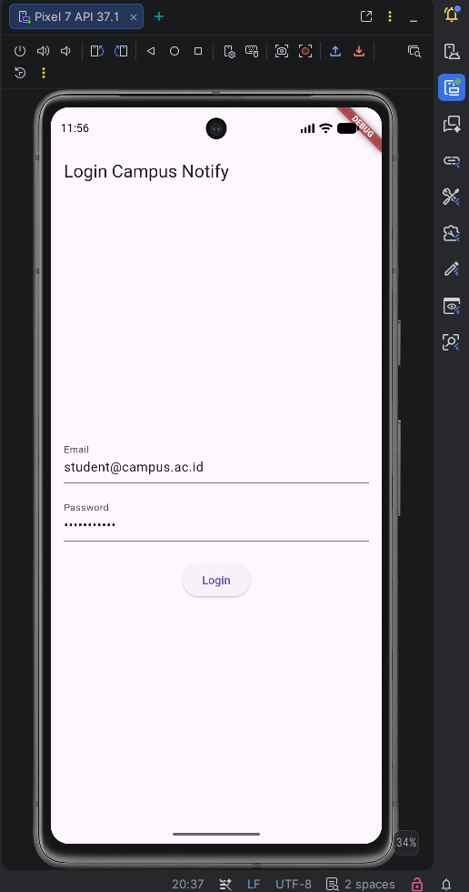
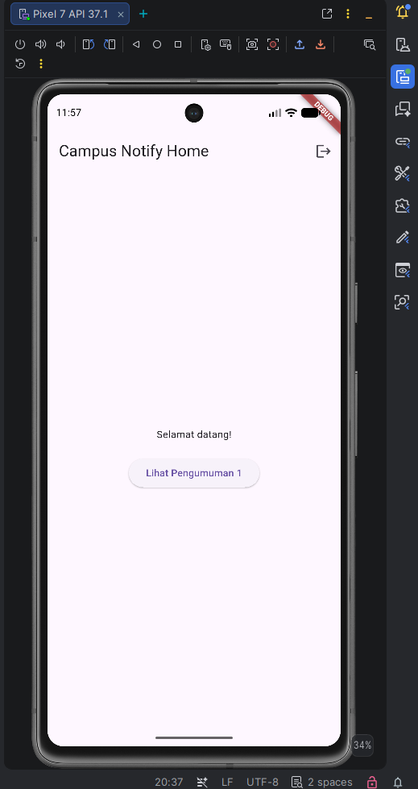

# Campus Notification App (Week 7 - Clean Architecture)

Aplikasi ini merupakan implementasi *Authentication*, *Security*, *Firebase Cloud Messaging* (FCM), yang sekarang telah di-refactor menggunakan **Clean Architecture (Feature-First)**.

## Fitur & Arsitektur Utama
- **Clean Architecture (Feature-First)**: Pemisahan tegas antara layer Presentation, Domain, dan Data di tiap fitur.
- **Dependency Rule**: Domain terbebas dari library eksternal (Dio, SQLite, FlutterSecureStorage). Semua dependensi mengarah ke dalam (Presentation -> Domain <- Data).
- **Riverpod for DI**: Menggunakan Riverpod sebagai Dependency Injection terpusat di presentation providers.
- **Failures via Record**: Penanganan error menggunakan record return type `({Data? data, Failure? failure})` untuk mencegah kebocoran exception ke UI.

## Hasil Audit (Sebelum Refactor)
| File | Layer saat ini | Masalah |
|---|---|---|
| `pages/login_page.dart` | presentation | *(Aman, tetapi struktur folder kurang spesifik)* |
| `providers/auth_provider.dart`| presentation (state) | Masih memanggil repository dengan import langsung, bukan via interface domain. |
| `data/auth_repository.dart` | data (+kontrak tercampur) | Interface dan implementasi masih satu kelas, terikat langsung dengan Dio. |
| `data/token_store.dart` | data | Menggunakan Secure Storage di layer data umum, tidak terikat ke fitur auth spesifik. |

## Struktur Baru
Fitur `auth` telah di-refactor secara utuh:
- **Domain**: Entitas `AuthSession`, interface `AuthRepository`, use case `LoginUseCase`, dan error `NetworkFailure`.
- **Data**: Implementasi `AuthRepositoryImpl`, data source `TokenStore`.
- **Presentation**: `login_page.dart`, dan `auth_providers.dart` sebagai wiring DI.

*(Detail keputusana arsitektur dan trade-off tercatat di `docs/AI_CHALLENGE.md`)*

## Pengujian Tiga Grep (Bukti Sterilitas)
1. `rg "Dio|FlutterSecureStorage" lib/features/*/presentation` ➡️ **0 Hasil**
2. `rg "import 'package:dio" lib/features/*/domain lib/core` ➡️ **0 Hasil**
3. `flutter analyze` & `flutter test` ➡️ **Lulus semua.**

## Cara Menjalankan
1. `flutter pub get`
2. `flutter test` (Untuk memastikan use case berjalan dengan baik menggunakan mock repository).
3. `flutter run`

## Bukti Tampilan (Identik dengan Minggu 6)

Karena arsitektur di-refactor tanpa mengubah UI atau *behavior* aplikasi, tampilan aplikasi (baik Login maupun Home) terlihat **100% sama (identik)** dengan implementasi minggu sebelumnya.

**Halaman Login (Setelah Refactor):**

**Halaman Home (Setelah Refactor):**

